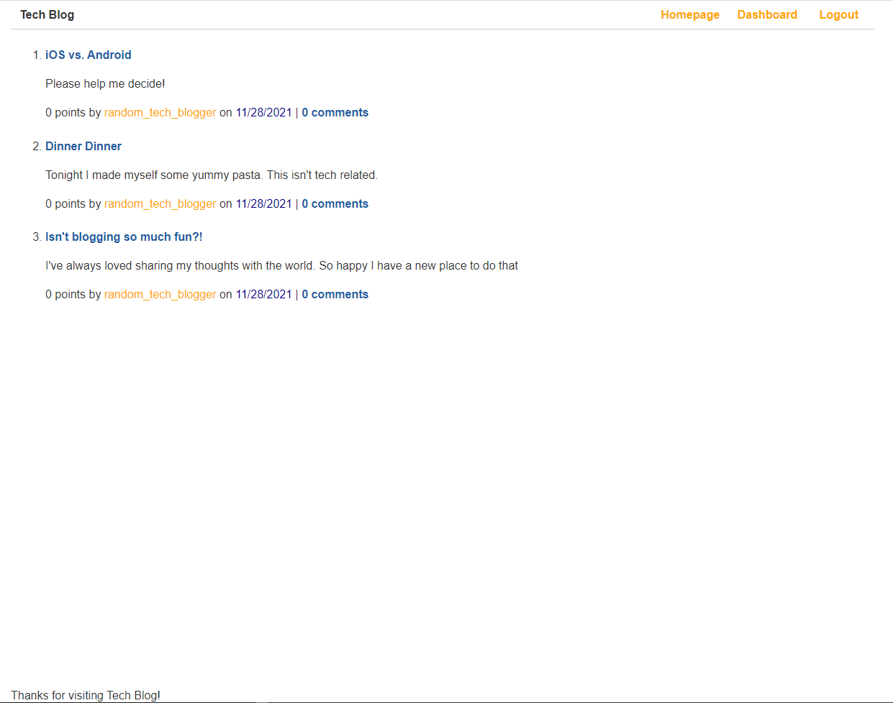
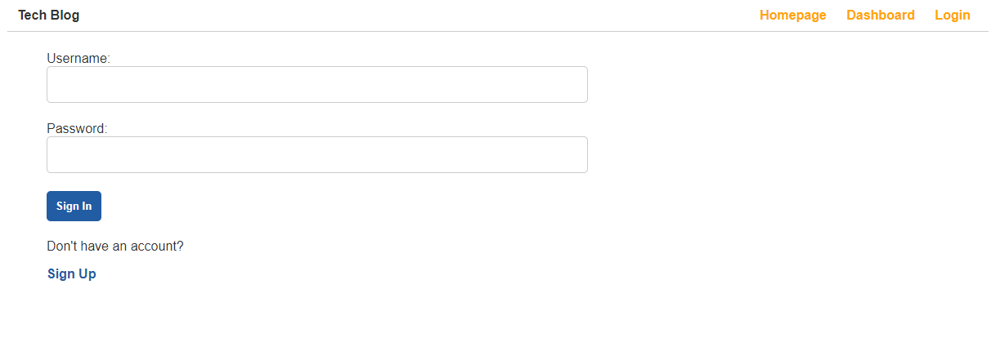
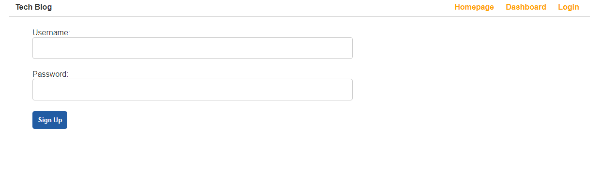
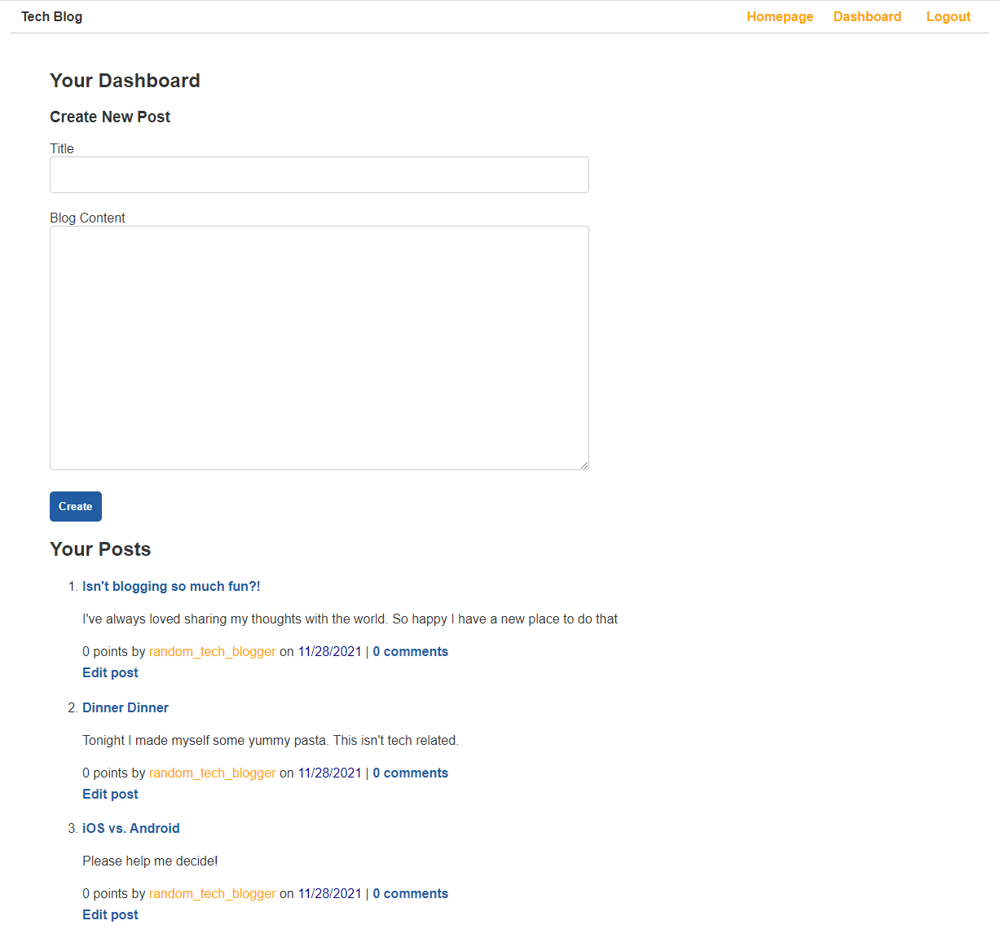
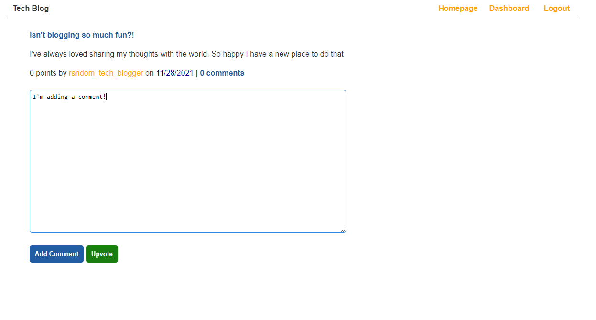
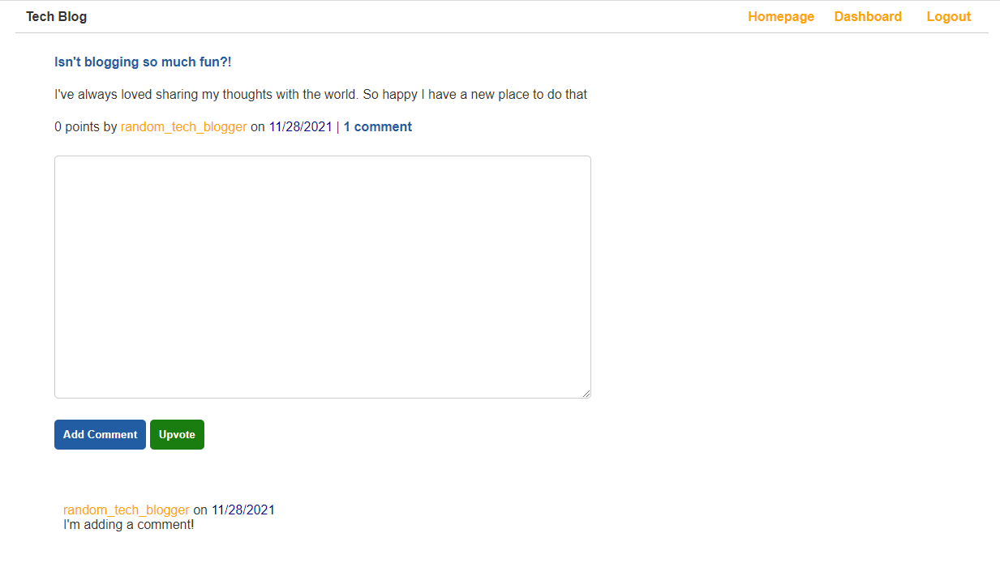

[](https://opensource.org/licenses/MIT)

# MVC Tech Blog

## Description

This project serves as an online tech blog for anybody to use. It utilizes a variety of packages. Sequelize as the ORM to mysql, express-handlebars as the MVC and templating engine, bycrypt for password hashing, dotenv for environment variables, express-session along with connect-session-sequelize to create user sessions for authentication, etc. 

Users that want to use this project can create blog posts with titles and text content, but only if they have signed up and are currently logged in. The homepage will display all blog posts, while the user's dashboard will display all that user's blog posts along with the comments associated with them. From the dashboard, a user can also edit previous posts' titles and texts, while also having the option to delete any of them.

Users can also vote on a post if they like it, but they can only vote on a post once. 

There are some other features and I invite you to explore them all here on the deployed application: 

https://mvc014-tech-blog.herokuapp.com/

## Table of Contents

* [Screenshots](#screenshots)
* [Installation](#installation)
* [Usage](#usage)
* [License](#license)
* [Questions](#questions)

## Screenshots

Homepage


Login Page


Signup Page


Dashboard Page


Adding Comment


Comment Saved


## Installation

There are a few different steps to getting this application installed and ready to go.

Step 1: Install mysql if you haven't already. Please refer to online documents to get mysql up and running (I used [this one](https://coding-boot-camp.github.io/full-stack/mysql/mysql-installation-guide)).

Step 2: Clone the repo onto your local machine.

Step 3: Create a .env file in the root of the project.

Step 4: In the newly created .env file, set 

DB_NAME='techblog_db' 

DB_USER='root' 

DB_PW='(the password you created when you installed mysql)'

You should be ready to move onto usage after these four steps.


## Usage

Continuing from the installation instructions, the following steps will help you use this application.

Step 5: In your terminal at the root of the project folder, run the command

``` 
mysql -u root -p
```

It will prompt you to enter a password. Please enter the password you created when you installed mysql.

Step 6: Run the command

```
source db/schema.sql
```

If there are no error messages, run 

```
quit;
```

Step 7: In order to invoke the application to connect to the database run the command

```
npm start
```

Step 9: Navigate to your web browser and type in localhost:3001

You are now ready to use the application offline on your own local machine.


## License

Copyright 2021 Alex Sadrgilany

Permission is hereby granted, free of charge, to any person obtaining a copy 
of this software and associated documentation files (the "Software"), to deal 
in the Software without restriction, including without limitation the rights to 
use, copy, modify, merge, publish, distribute, sublicense, and/or sell copies of the 
Software, and to permit persons to whom the Software is furnished to do so, 
subject to the following conditions:

The above copyright notice and this permission notice shall be included in all 
copies or substantial portions of the Software.

THE SOFTWARE IS PROVIDED "AS IS", WITHOUT WARRANTY OF ANY KIND, EXPRESS OR IMPLIED, 
INCLUDING BUT NOT LIMITED TO THE WARRANTIES OF MERCHANTABILITY, FITNESS FOR A 
PARTICULAR PURPOSE AND NONINFRINGEMENT. IN NO EVENT SHALL THE AUTHORS OR COPYRIGHT 
HOLDERS BE LIABLE FOR ANY CLAIM, DAMAGES OR OTHER LIABILITY, WHETHER IN AN ACTION OF 
CONTRACT, TORT OR OTHERWISE, ARISING FROM, OUT OF OR IN CONNECTION WITH THE SOFTWARE 
OR THE USE OR OTHER DEALINGS IN THE SOFTWARE.

## Questions

[My GitHub Profile](https://github.com/asadg7)

To reach me with questions, please email: asadrgilany7@gmail.com

